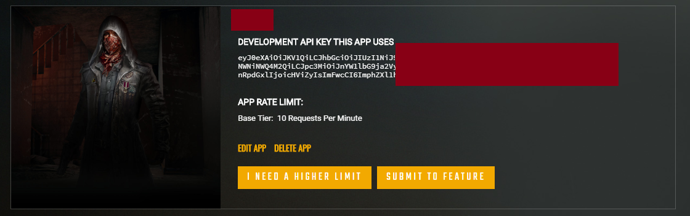
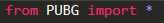
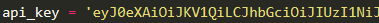
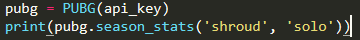
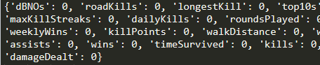
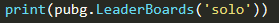
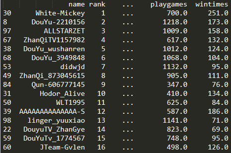
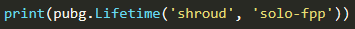
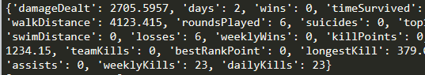

# PUBG

### GET API KEY
[PUBG API LINK](https://developer.pubg.com/) sign in and get your's API key and get more information at **DOCUMENTATION**

### Example

- Load PUBG api python file 

- Input your API key 

- Use season_stats function 
  - return type: dictionary 
  

  - result 
  
  
- Use Leader board function 
  - return type: Dataframe 
  
  
  - result 
  

- Use user lifetime function 
  - return type: dictionary 
  
  
  - result 
  
